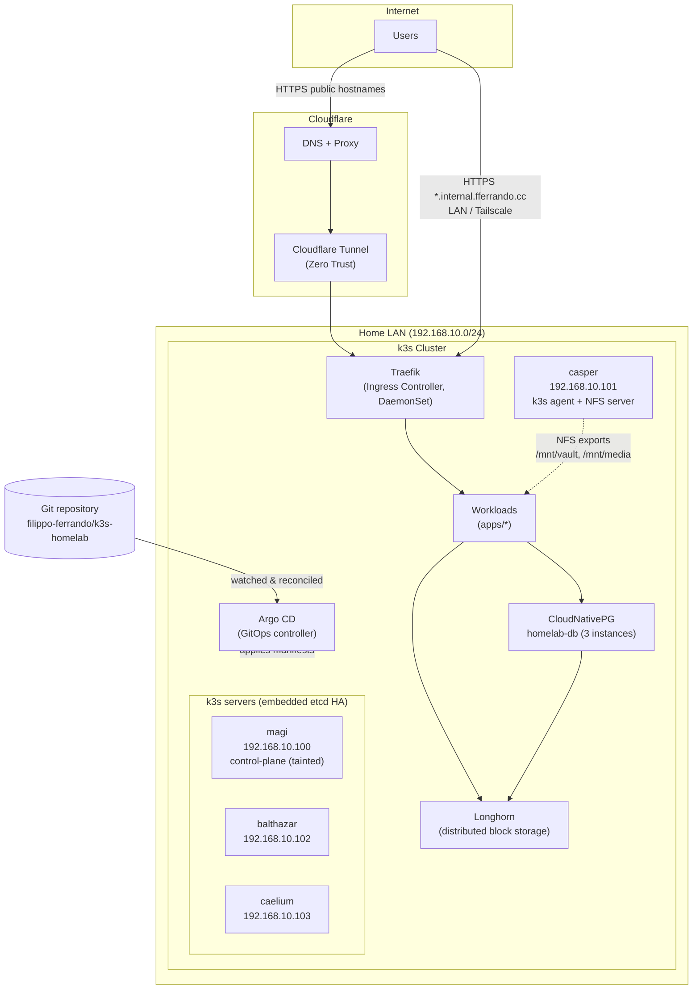
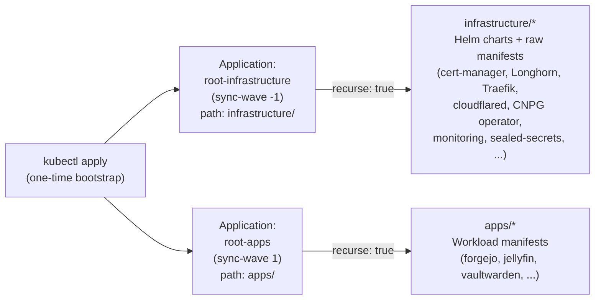
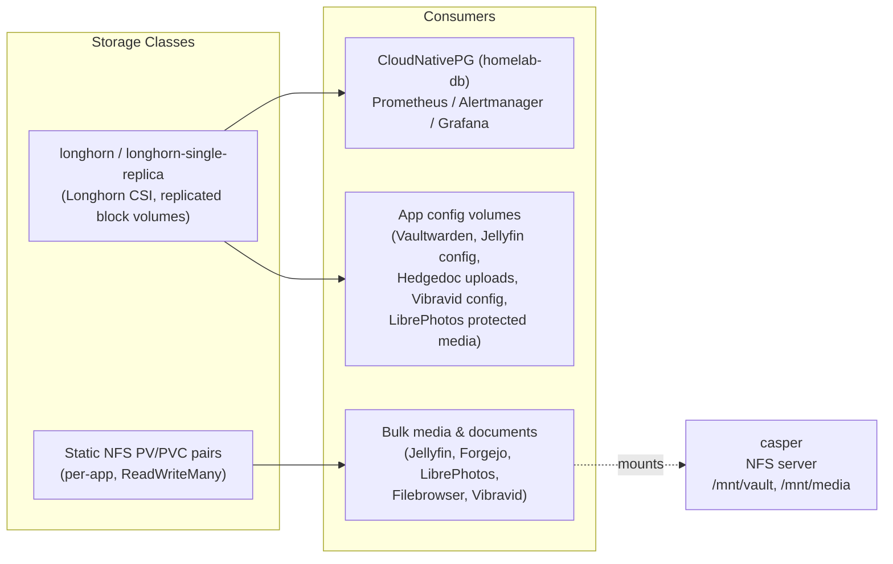
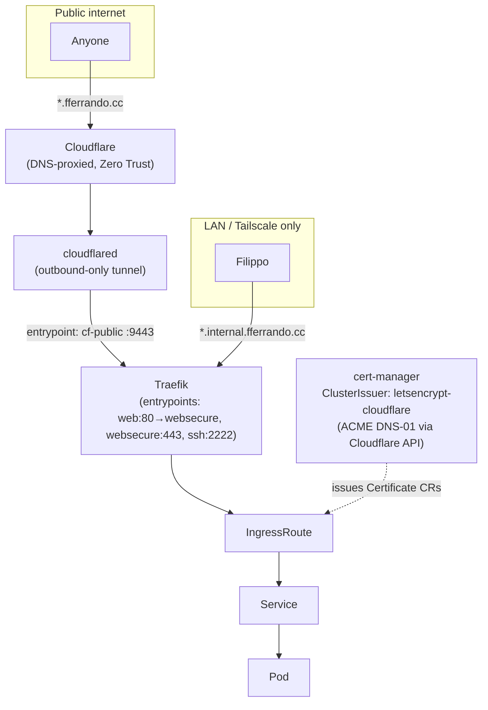
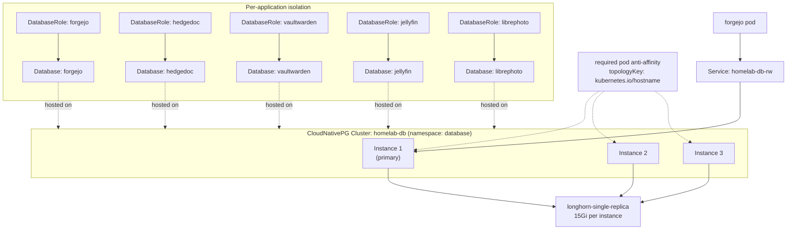
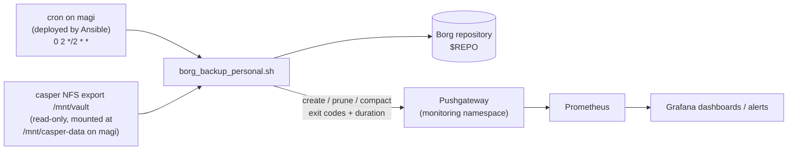

# k3s-homelab

A self-hosted, GitOps-driven Kubernetes homelab. The entire cluster — from bare-metal OS prep to running applications — is defined as code and reconciled continuously by Argo CD. Nothing is deployed by hand: Ansible provisions the hosts and bootstraps the cluster once, then Git becomes the single source of truth.

## At a glance

| | |
|---|---|
| **Orchestration** | k3s (embedded etcd, 3-server HA control plane) |
| **GitOps engine** | Argo CD (app-of-apps pattern) |
| **Ingress** | Traefik (DaemonSet) + Cloudflare Tunnel |
| **TLS** | cert-manager + Let's Encrypt (Cloudflare DNS-01) |
| **Storage** | Longhorn (distributed block) + NFS (bulk media/data) |
| **Database** | CloudNativePG (HA Postgres, 3 instances) |
| **Secrets** | Bitnami Sealed Secrets |
| **Observability** | kube-prometheus-stack (Prometheus, Grafana, Alertmanager) + Pushgateway |
| **Maintenance** | Kured (reboot orchestration) + descheduler + Ansible patch playbooks |
| **Backups** | Borg, pushed to Prometheus via Pushgateway |
| **Provisioning** | Ansible (OS prep, k3s bootstrap, NFS, backup jobs) |

---

## Architecture overview



### Node roles

| Host | IP | k3s role | Notes |
|---|---|---|---|
| `magi` | `192.168.10.100` | server (cluster-init) | Control-plane, tainted `NoSchedule` — runs only control-plane + tolerated system pods (Kured, etc.) |
| `balthazar` | `192.168.10.102` | server | Also schedulable compute node |
| `caelium` | `192.168.10.103` | server | Also schedulable compute node |
| `casper` | `192.168.10.101` | agent | Dedicated NFS server (`/mnt/vault`, `/mnt/media`), no control-plane role |

k3s runs with embedded etcd across all three servers (`--cluster-init`), `nftables` kube-proxy mode, and the bundled Traefik disabled in favor of the Helm-managed Traefik deployed through Argo CD. Every node is also joined to a Tailscale tailnet for out-of-band SSH access.

---

## GitOps model: app-of-apps

Everything under `infrastructure/` and `apps/` is managed by two root Argo CD `Application` resources defined in [`system/root-app.yaml`](system/root-app.yaml):



Both roots use `directory.recurse: true`, so **any** manifest added under `infrastructure/` or `apps/` is picked up automatically — no per-app Argo CD `Application` needs to be registered by hand. Both sync with `automated: {prune: true, selfHeal: true}`, meaning drift is corrected automatically and deleting a manifest from Git deletes the resource from the cluster.

### Sync-wave ordering

Deployment order is controlled entirely through `argocd.argoproj.io/sync-wave` annotations, since dependencies (CRDs, storage classes, secrets, databases) must exist before the things that consume them:

| Wave | Components |
|---|---|
| `-4` | Sealed Secrets, Longhorn |
| `-3` | cert-manager, CloudNativePG operator, Traefik |
| `-2` | Kured |
| `-1` | `root-infrastructure`, kube-prometheus-stack, descheduler, Longhorn `storageclass-single` |
| `0` | Argo CD server config, cloudflared |
| `1` | `root-apps`, Pushgateway |
| `2` | Argo CD ingress, cert-manager `ClusterIssuer`, Longhorn middleware/NetworkPolicy, CNPG `Cluster` (`homelab-db`) |
| `3–4` | Per-app CNPG `DatabaseRole` / `Database` objects |
| `5` | LibrePhotos multi-container stack |
| `6` | Application `IngressRoute`s |

This produces a **two-phase boot**: on a fresh cluster, `cloudflared` and `cert-manager` will briefly show errors because the Sealed Secrets they depend on haven't decrypted yet — this is expected and self-heals once secrets are sealed and pushed (see [Bootstrapping](#bootstrapping-a-new-cluster)).

---

## Repository structure

```
k3s-homelab/
├── system/
│   └── root-app.yaml            # The two app-of-apps Argo CD Applications
├── infrastructure/               # Cluster-wide platform services (one folder per component)
│   ├── sealed-secrets/
│   ├── longhorn/
│   ├── cert-manager/
│   ├── cloudnative-pg/           # CNPG operator only — the actual DB lives in apps/database
│   ├── traefik/
│   ├── cloudflared/
│   ├── kured/
│   ├── descheduler/
│   ├── kube-prometheus-stack/
│   ├── pushgateway/
│   └── argocd/                   # Argo CD's own ingress + config
├── apps/                          # Workloads — one folder per application/namespace
│   ├── database/                 # Shared CloudNativePG Postgres cluster
│   ├── forgejo/
│   ├── jellyfin/
│   ├── vaultwarden/
│   ├── librephoto/
│   ├── hedgedoc/
│   ├── filebrowser_quantum/
│   ├── vibravid/
│   └── portfolio/
├── ansible/                       # Bare-metal provisioning & day-2 host operations
│   ├── 01_os_prep.yml
│   ├── 02_bootstrap_cluster.yml
│   ├── 03_deploy_borg_backups.yml
│   ├── 04_deploy_nfs_shares.yml
│   ├── patch_cluster.yml
│   ├── prune_cached_images.yml
│   ├── inventory.ini
│   ├── group_vars/all.yml
│   └── scripts/                  # Borg backup scripts pushed to hosts
├── notes/                         # Runbooks (secret sealing, DB restore, config mgmt, kubeconfig)
├── todo.md                        # Full step-by-step deployment guide
└── renovate.json                  # Automated dependency updates (Helm charts + container images)
```

Every app folder follows the same convention: `namespace.yaml`, `deployment.yaml`, `service.yaml`, `ingressroute.yaml`, plus whatever storage/certificate/secret manifests it needs. Every infra folder is either a thin `Application` wrapper around an upstream Helm chart (with a companion `values.yaml`) or a set of raw manifests for things with no chart.

---

## Infrastructure stack

| Component | Purpose | Source | Version | Namespace |
|---|---|---|---|---|
| **Sealed Secrets** | Encrypts secrets so they're safe to commit to Git | `bitnami.github.io/sealed-secrets` | `2.19.3` | `kube-system` |
| **Longhorn** | Distributed block storage / CSI, snapshots, UI | `charts.longhorn.io` | `1.12.1` | `longhorn-system` |
| **cert-manager** | Automated TLS certs via ACME | `charts.jetstack.io` | `v1.21.1` | `cert-manager` |
| **CloudNativePG** | Postgres operator (HA clusters, backups, failover) | `cloudnative-pg.github.io/charts` | `0.29.0` | `cnpg-system` |
| **Traefik** | Ingress controller (DaemonSet), dashboard, metrics | `traefik.github.io/charts` | `41.4.0` | `traefik` |
| **cloudflared** | Cloudflare Tunnel client — exposes public services without opening inbound ports | raw manifest | `2026.8.3` | `cloudflared` |
| **Kured** | Coordinated node reboots after Kernel/RPM patching | `kubereboot.github.io/charts` | `6.1.0` | `kube-system` |
| **descheduler** | Rebalances pods (bin-packing, anti-affinity, duplicates) via CronJob | `kubernetes-sigs.github.io/descheduler` | `0.36.0` | `kube-system` |
| **kube-prometheus-stack** | Prometheus, Grafana, Alertmanager, node-exporter | `prometheus-community` | `89.2.3` | `monitoring` |
| **Pushgateway** | Accepts metrics pushed from ephemeral jobs (Borg backups) | `prometheus-community` | `3.8.0` | `monitoring` |
| **Argo CD** | GitOps controller (installed via Ansible, self-managed after) | upstream install manifest | `stable` | `argocd` |

Dependency versions across `infrastructure/**` and `apps/**` are kept current automatically by **Renovate** (`renovate.json`), which groups minor/patch bumps, labels infra vs. app PRs separately, and has custom rules for the Forgejo mirror and the portfolio's date-based image tags.

---

## Storage architecture

Two storage tiers are used depending on the workload's durability and size requirements:



- **`longhorn-single-replica`** (custom `StorageClass`, `numberOfReplicas: 1`) is used for stateful workloads that already have their own redundancy or where losing a replica's history is acceptable (Postgres — CNPG handles its own HA/backups — Prometheus/Alertmanager/Grafana, LibrePhotos protected-media cache). This trades Longhorn's replication overhead for lower resource use on a small cluster.
- **`longhorn`** (default multi-replica class) backs smaller, higher-value single-instance app volumes (Vaultwarden vault, Jellyfin config, Filebrowser config).
- **Static NFS PVs**, all served by `casper` (`192.168.10.101`) and mounted `ReadWriteMany` with `nfsvers=4.2`, back anything media/bulk-storage related: Jellyfin's library, Forgejo's git data, LibrePhotos' photo library, Filebrowser's shared folders, and Vibravid's downloads. Every NFS-backed app gets its own dedicated `PersistentVolume`/`PersistentVolumeClaim` pair pointing at a specific export path (e.g. `/mnt/media`, `/mnt/vault/git`, `/mnt/vault/data`).
- A `NetworkPolicy` scopes Longhorn manager metrics so only Prometheus (in `monitoring`) can scrape port `9500`, and the Longhorn UI is protected by a Traefik `basicAuth` `Middleware` backed by a sealed secret.

---

## Networking & ingress



- **Traefik** runs as a DaemonSet with dedicated entrypoints: `web` (80, redirects to HTTPS), `websecure` (443, HTTP/3 enabled), `ssh` (2222, TCP passthrough for Forgejo git-over-SSH), `cf-public` (9443, dedicated entrypoint for traffic arriving through the Cloudflare Tunnel), and a `metrics` entrypoint scraped by Prometheus. The dashboard is exposed at `traefik.internal.fferrando.cc`.
- **Cloudflare Tunnel** (`cloudflared`) gives public services an outbound-only path to the internet — no ports are forwarded on the home router. Each public app has an `IngressRoute` bound to the `cf-public` entrypoint.
- **cert-manager** issues all TLS certificates via a single `ClusterIssuer` (`letsencrypt-cloudflare`) using ACME DNS-01 challenges against the Cloudflare API, so certificates can be issued for internal-only hostnames too (no need for HTTP-01/port 80 reachability).
- Every app that needs both internal and public access declares **two** `IngressRoute`s in the same manifest — one on `websecure` for `*.internal.fferrando.cc` (LAN/Tailscale), one on `cf-public` for the public `fferrando.cc` domain — letting a single app be selectively exposed.

---

## Database layer

A single shared, highly-available CloudNativePG cluster backs every relational-database-consuming app:



- `homelab-db` runs **3 instances** spread across nodes with a *required* pod anti-affinity rule (`topologyKey: kubernetes.io/hostname`), so a single node failure never takes down the primary and two replicas at once.
- Each app owns its own login role and logical database via CNPG's declarative `DatabaseRole`/`Database` CRDs (sync-waves 3–4, after the cluster itself at wave 2) — apps never share credentials or a database, only the cluster.
- Credentials are auto-generated by the operator into per-role `Secret`s (e.g. `forgejo-db-credentials`) and wired into each app's `Deployment` via `secretKeyRef` — no plaintext DB passwords in Git.
- Consumers: **Forgejo**, **Hedgedoc**, **Vaultwarden**, **Jellyfin** (via a Postgres-patched image), and **LibrePhotos**.
- Restoring a dump into the cluster is done by temporarily port-forwarding the `-rw` service and piping a `.sql` file through `psql` — no direct pod exec required (see [`notes/db_backup_and_restore.md`](notes/db_backup_and_restore.md)).

---

## Applications

| App | Description | Image | Access | Storage |
|---|---|---|---|---|
| **Forgejo** | Self-hosted Git forge (this repo's own home) | `codeberg.org/forgejo/forgejo:16` | `git.internal.fferrando.cc` · `git.fferrando.cc` · SSH `:2222` | NFS (`/mnt/vault/git`, 2Ti) + CNPG |
| **Jellyfin** | Media server | `ghcr.io/jpvenson/jellyfin.pgsql:10.11.11-1` (Postgres-backed fork) | `jellyfin.internal.fferrando.cc` · `jellyfin.fferrando.cc` | Longhorn config (7Gi) + NFS media (2Ti) + CNPG |
| **Vaultwarden** | Bitwarden-compatible password manager | `vaultwarden/server:1.37.2-alpine` | `vault.internal.fferrando.cc` (internal only) | Longhorn (3Gi) + CNPG |
| **LibrePhotos** | Self-hosted Google-Photos alternative (frontend/backend/proxy/Redis) | `reallibrephotos/librephotos*:1.1.0` | `photo.internal.fferrando.cc` · `photo.fferrando.cc` | Longhorn protected-media (10Gi) + NFS library (2Ti) + CNPG + Redis |
| **Hedgedoc** | Collaborative Markdown editor | `quay.io/hedgedoc/hedgedoc:1.12.0` | `doc.fferrando.cc` (public only) | Longhorn uploads (5Gi) + CNPG |
| **Filebrowser Quantum** | Web file manager over shared storage | `gtstef/filebrowser:2.0.4-beta` | `files.internal.fferrando.cc` · `files.fferrando.cc` | Longhorn config (5Gi) + NFS data & media (2Ti each) |
| **Vibravid** | Media/download manager | `ghcr.io/astraelabs/vibravid:v1.4.0` | `download.internal.fferrando.cc` (internal only) | Longhorn config (1Gi) + NFS media (2Ti) |
| **Portfolio** | Personal site, built & published by CI to Forgejo's own registry | `git.fferrando.cc/rdfilippo/portfolio:<date>-<build>` | `fferrando.cc` (public only) | stateless |

All application images and Helm chart versions are tracked and auto-updated by Renovate; the portfolio image uses a custom `YYYYMMDD-HHMM` versioning scheme matched by a dedicated Renovate rule so CI-built tags are picked up correctly.

---

## Backups



- Host-level backups (personal data, and an optional Postgres `pg_dumpall` job) run via **Borg**, scheduled by the `03_deploy_borg_backups.yml` Ansible playbook directly on the `magi` host — deliberately outside the cluster, so backups keep working even if the cluster itself is unhealthy.
- Each run pushes structured metrics (`backup_status`, per-stage exit codes, duration, last-success timestamp) to the in-cluster **Pushgateway**, making backup health visible in Grafana/Alertmanager alongside every other cluster metric.
- The source data is exposed as a **read-only** NFS export (`/mnt/vault`, restricted to `magi`'s IP) so the backup host never has write access to the live share.

---

## Monitoring & observability

- **kube-prometheus-stack** provides Prometheus, Grafana, and Alertmanager, all persisted on `longhorn-single-replica` volumes with bounded retention (5 days / 3GiB for Prometheus) suited to homelab-scale resources.
- Every infra component that can emit metrics is wired up: Traefik (`ServiceMonitor` on the `metrics` entrypoint), Longhorn (`ServiceMonitor` + a `NetworkPolicy` allowing only Prometheus to scrape it), CloudNativePG (`enablePodMonitor`), cert-manager, Kured, and the Pushgateway.
- **Pushgateway** bridges metrics from things that aren't long-running scrape targets — currently the host-level Borg backup jobs.
- Grafana is reachable at `stats.internal.fferrando.cc` (default credentials are rotated after first login).

---

## Secrets management

Secrets are never committed in plaintext. **Sealed Secrets** (Bitnami) encrypts a `Secret` manifest against the cluster's public key so the resulting `SealedSecret` is safe to store in Git — only the controller running in-cluster can decrypt it. This is what makes the **two-phase boot** necessary: on a brand-new cluster, `cloudflared` (tunnel token), `cert-manager` (Cloudflare API token for DNS-01), and the Longhorn UI (BasicAuth) all wait for their sealed secrets to be generated and pushed before they can become healthy. The exact commands for fetching the cluster's public cert and sealing each secret are documented in [`notes/kubeseal_secrets.md`](notes/kubeseal_secrets.md).

---

## Automated maintenance

- **Kured** watches for a reboot-sentinel file and coordinates safe, one-at-a-time node reboots during a nightly maintenance window (01:00–05:00 Europe/Rome), with a custom `drainPodSelector` that works around a known Longhorn PDB-deadlock issue ([longhorn/longhorn#5910](https://github.com/longhorn/longhorn/issues/5910)) where instance-manager/CSI-sidecar PodDisruptionBudgets can otherwise block drains indefinitely.
- **`patch_cluster.yml`** (Ansible) runs a full `dnf update` across every node and flags Kured's reboot sentinel when the kernel/libs actually changed — patching and reboot orchestration are decoupled: Ansible patches, Kured decides when it's safe to reboot.
- **`prune_cached_images.yml`** (Ansible) runs `crictl rmi --prune` across the cluster to reclaim disk from unused container images.
- **descheduler** runs as a CronJob every 12 hours to rebalance the cluster (remove duplicate pods, fix anti-affinity violations, and even out CPU/memory/pod-count utilization across nodes) — useful on a small, heterogeneous cluster where pods can otherwise pile up on one node.
- Every node is joined to a **Tailscale** tailnet with SSH enabled during OS prep, giving remote management access independent of the LAN or any in-cluster service.

---

## Bootstrapping a new cluster

High-level order of operations (full detail in [`todo.md`](todo.md)):

1. **Prep hosts** — `ansible-playbook -i ansible/inventory.ini ansible/01_os_prep.yml` (packages, SELinux, sysctls, Tailscale, firewalld, iSCSI for Longhorn).
2. **Bootstrap k3s + Argo CD** — `ansible/02_bootstrap_cluster.yml` initializes the first server, joins the remaining servers and the agent, then installs upstream Argo CD manifests.
3. **Mount NFS shares** — `ansible/04_deploy_nfs_shares.yml` configures exports on `casper` and opens the required firewall ports.
4. **Deploy host backup jobs** — `ansible/03_deploy_borg_backups.yml` on `magi`.
5. **Fetch kubeconfig** to your workstation (see [`notes/fetch_kubeconfig.md`](notes/fetch_kubeconfig.md)).
6. **Apply the root Argo CD Applications**: `kubectl apply -f system/root-app.yaml` — this kicks off the entire GitOps reconciliation of `infrastructure/` and `apps/`.
7. **Seal and commit secrets** (Cloudflare API token, tunnel token, Longhorn BasicAuth) once the Sealed Secrets controller is up — see [`notes/kubeseal_secrets.md`](notes/kubeseal_secrets.md). Pushing these to Git lets `cert-manager`, `cloudflared`, and the Longhorn UI leave their expected "two-phase boot" error state.
8. **Verify** every endpoint in the table below comes up healthy in Argo CD.

### Endpoint matrix

| Service | Internal URL | Notes |
|---|---|---|
| Argo CD | `argocd.internal.fferrando.cc` | Admin password from `argocd-initial-admin-secret` |
| Traefik dashboard | `traefik.internal.fferrando.cc` | Ingress/router status |
| Longhorn UI | `longhorn.internal.fferrando.cc` | BasicAuth via sealed secret |
| Grafana | `stats.internal.fferrando.cc` | Default `admin` / rotate after first login |
| Pushgateway | `pushgateway.internal.fferrando.cc` | Target for host Borg backup metrics |
| Forgejo | `git.internal.fferrando.cc` / `git.fferrando.cc` | Internal + public via Cloudflare Tunnel |

---

## Notes & runbooks

The [`notes/`](notes/) directory holds focused, task-specific runbooks referenced throughout this document:

- [`fetch_kubeconfig.md`](notes/fetch_kubeconfig.md) — pulling a working `kubeconfig` from the primary server
- [`kubeseal_secrets.md`](notes/kubeseal_secrets.md) — generating every `SealedSecret` used by the cluster
- [`db_backup_and_restore.md`](notes/db_backup_and_restore.md) — restoring a `.sql` dump into the shared CNPG cluster
- [`manage_configs.md`](notes/manage_configs.md) — patterns for managing app config (env vars vs. mounted `ConfigMap`s) the GitOps way
